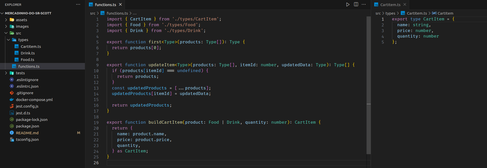

# README: Products List



## Project Description

This is my second project using TypeScript in the backend module. It's a small market management app. I've focused on improving my ability to type each function and variable correctly, using type assertion and generics.

### Technologies

- LINUX
- VSCODE
- TYPESCRIPT


### What I Learned

- How to type functions and variable using type assertion
- How to determine what type I'll use when I call a function with generic type

## How to Run the Project

1. Clone the repository:

   ```bash
   git clone https://github.com/feduarte-dev/mercadinho-do-sr-scott
   ```

2. Navigate to the project directory:

   ```bash
   cd your-repository
   ```

3. Install dependencies:

   ```bash
   npm install
   ```

4. Test the application:

   ```bash
   npm test
   ```

## Contributions

[Felipe](https://www.linkedin.com/in/feduarte-dev/) -  /src


[Trybe](https://www.betrybe.com/) - Everything else
